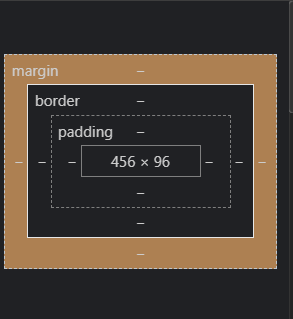

# Modern HTML & CSS From The Beginning (Incluing Sass)

---

[Unsplash](https://unsplash.com)
[Pexels](https://pexels.com)

## Notes about Divs

* Orange Margins
* Greenis Padding

## Flexbox

* Modern layout mode in CSS3
* "flex" is a value for display property
* Replaces floats and is much more elegant to work with
* Flex items can re-ordered via CSS
